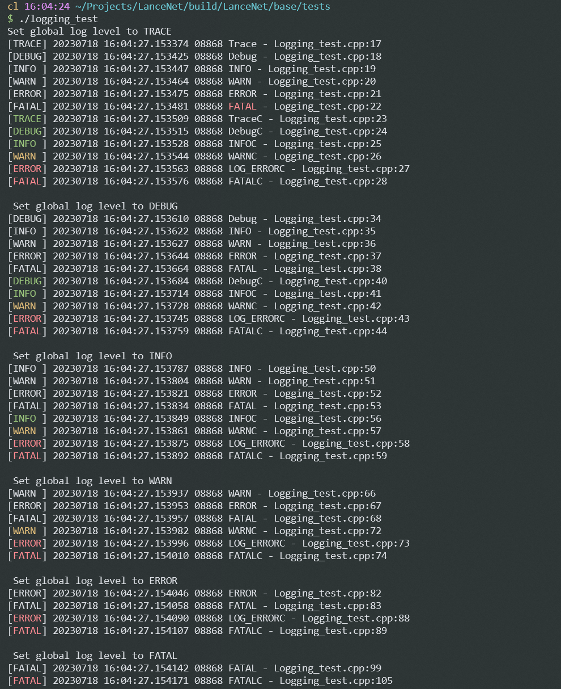

# ⚡LanceNet： 一个基于Reactor模式的高性能网络库⚡


## 引言 👀

**代码统计**


​	本网络库旨在使用现代c++从零开始构建一个高性能的网络库，用作编程练习，将计算机网络，现代c++编程，软件工程等知识进行一次实际的项目转化，为了防止闭门造车，脱离主流的开发环境和思想，本项目的设计参考了陈硕的 《Linux多线程服务端编程》、《CSAPP》、《Effective C++》、《Effective Modern C++》等书籍，学习并践行了很多实用和现代C++知识和设计思想

​	  简单来说，本项目使用Modern C++重构了muduo网络库，大部分代码均基于**c++11**进行了重写，精简或改进 ，使用smart pointer改善了内存管理，对一些类的实现进行了加强和改进，实现的echo服务能达到**百万pqs**, 甚至超越了muduo库，实现的优化包括但不限于：

1. **Buffer类**

   为了防止在高并发数量的情况下，Buffer初始大小设置过大导致内存消耗大的问题，muduo中使用较小的Buffer大小初始化输入输出缓冲区，并使用linux 分散输入函数`readv(2)`结合栈空间**避免多次系统调用或复制数据的开销**，但由于栈空间仍然是个稀缺资源（大小十分有限），**开辟较大的栈空间可能直接或间接导致栈溢出**

   🎯【改进】 **LanceNet** 利用GCC线程局部存储`__thread`构建了一个线程局部缓冲区，避免了开辟栈空间和可能导致的栈溢出的问题。同时由于thread local特性避免了加锁开销

2. **Timestamp时间戳类**：

   muduo采用使用`gettimeofday(2)`等函数来获取 从unix epoch 到现在的秒数和微秒数，精度**只能到微秒级别**

   ✨【改进】基于**标准库std::chrono库**，精度能达到**纳秒**级别

   

3. **LogStream类**: 

   兼顾了流式输出的优点(类型安全) 和 类似于printf方便的格式化

   [改进] 引入了了适用领域最先进的**浮点型数据转字符串 Grisu3**算法，比snprintf快数**4**倍

   > 参见 Grisu3算法论文 ：Loitsch, 《[*Printing Floating-Point Numbers Quickly and Accurately with Integers*](https://dl.acm.org/citation.cfm?id=1806623)》
   >
   > 参见 [GitHub 仓库](https://github.com/abolz/Drachennest/tree/master) 查看Grisu3算法的开源实现

   [改进 ] 支持类似于printf那样的格式化,例如 `LOG_INFO << Fmt("%d, %s", 1, "hello")`;

   

4. **TimerQueue计时器类**

   - **muduo库的方案**：为了**快速得到当前已经过时的计时器**和正确处理**同一时间多个计时器到期**的情况，muduo采用`set<pair<TimeStamp, Timer*>> ` 来管理计时器，并使用**裸指针**，存在泄露风险

   - 若在原来设计上采用set<pair<TimeStamp, unique\<Timer\>>>进行改进，需要涉及C++14 [异构查找](https://www.cppstories.com/2019/05/heterogeneous-lookup-cpp14/)，同时对于set存储设计unique_ptr等只能移动的类型，我们使用upper_bound 找到所有过期的计时器并移出set但这又会涉及到C++17的内容，其中引入的set::[extract]([std::set::extract - cppreference.com](https://en.cppreference.com/w/cpp/container/set/extract))是唯一能将move-only object移出set的方式，这会大大引入没必要的实现复杂度。

     >  有关异构查找和std::set::extract() (C++17)的使用示例参见测试源码 `/LanceNet/LanceNet/net/tests/HeterLookUpAndSetExtract.cpp`

     - **我的方案**：采用小顶堆对Timer进行管理，具体的，使用`priority_queue`存储pair类型pair<TimeStamp, vector<unique\<Timer\> > >, 简单使用TimeStamp即可查找过期的Timer，避免涉及C++14和C++17, 同时在使用过程中可能设计 lambda 表达式和 move-only object 两者的交互这样一个在C++11中比较棘手的问题，但本项目采用如下的方案解决了该问题
     - 在c++11中，由于不支持直接将对象移动到lambda中，但可以使用lambda 和 std::bind来模拟实现 `参见Eeffective Modern C++ Item 32`

     ```c++
     std::bind([](const T& data), this, std::move(data)) 
         // data is a move-only object
     ```

     2. 如果使用c++14，可以直接使用**init capture**将对象直接移动到lambda 生成的closure class中，详见 《Effective Mordern C++》Item 32 ： Use init capture to move objects into closure

     ```c++
     auto func = [data = std::move(data)]
                {/*use of data*/};
     ```

     


# Designs ✨

## 1. 基础库（LanceNet base library）

基础库主要是对posix系列的函数进行封装，主要包括

1. 对pthread的封装
1. 对条件变量的封装
1. 对锁的封装
1. 对常见unix系统调用的封装
1. 日志库
1. 线程池
1. 高层同步设施：生产消费者队列、**Circular Buffer**、倒计时（CountDownLatch）、**Monitor**(仿Java Monitor)
1. 底层同步设施：条件变量的封装


#### 0.1 多线程异步日志库

**日志格式**：[LOG_LEVEL] 20990101 12:10:01.123456 Message - Example.cpp:100

**特点[改进]：**

1. 时间戳，基于**标准库std::chrono库**，精度能达到纳秒级别

2. 更改了默认的`snprintf`整数浮点数转字符串的算法

   使用 两种高性能的算法，提升了**整型和浮点型数值转字符串**的速度

3. 高精度的时间间隔计算，最高精确到纳秒($1e^{-9}s$), 时间戳采用了微秒，原因是这个精度一般够用了

4. 避免使用time_t，防止在2038年发生溢出

5. 使用GCC内置的 __builtin_strrchr 在**编译期**即可获得文件名的basename

   ```c++
   #define BASENAME(FILE) (__builtin_strrchr(FILE, '/') ? __builtin_strrchr(FILE, '/') + 1 : FILE)
   ```

   

6. 支持控制台**彩色**字体输出




#### 0.2 Buffer设计和使用 

​	非阻塞网络编程中，如何设计并使用缓冲区？一方面希望减少系统调用次数，另一方面我们想节约内存，例如10k连接每个链接个分配一个读写缓冲区，将消耗1GB内存，但多数情况下这些缓冲区利用率是很低的。

【基本】采用readv(2)解决了这个问题：在栈上临时开辟一个空间，使用readv往buffer和这个空间填充，若数据量小，没有超过Buffer的writable字节数，直接读到Buffer中，否则读到这个临时空间，然后append到Buffer里面，避免每个连接的初始化Buffer多大造成内存浪费

【优化】进一步的，分类防止stack空间紧张，采用thread local的extrabuf进一步优化空间使用（但不能全局共享一个）


## 2. 核心库 🎈

### Main Features

​	LanceNet网络库采用和module 类似的 **one loop per-thread** + **thread pool**的设计方案

1. 支持多线程多开EventLoop，创建多个IO thread，使用Round-Robin实现了简单的**负载均衡**

2. 同时支持了**Select**、**Poll**、**Epoll**（**LT**模式）三种IO 复用方式。采用抽象接口的方式，隔离了实现

3. 支持应用层发送和接收**应用层缓冲区**，【改进】读socket采用了thread local extral buffer 和  scatter input的方式减少系统调用

4. 提供了“三个半”事件的**回调接口**（见 *《Linux 多线程服务端编程* 》 “TCP网络编程本质”），用户可用方便的注册自己的处理函数实现业务逻辑

5. 构建了一种==消息反射==（**ProtobufMsgCodec**） 和 ==消息分发==（**ProtobufMsgDispatcher**）**的网络传输和处理方案**，进一步简化了应用的构建

   - 以具体类的形式提供，用户可以方便的将`ProtobufCodec`和`ProtobufMessageDispatcher`组合(Composite) 到自己的类中，即插即用，当然你也可以不用，LanceNet不强迫你非得怎么样，提供最大的灵活性🙃
   
   - **ProtobufMsgCodec**： 基于Google Protobuf作为网络通信协议的设计，根据不同的消息类型自动地进行序列化（编码）和反序列化（解码）
   
   - **ProtobufMsgDispatcher**：根据消息类型，**分发**到不同处理函数（用户需要提前注册某个消息类型和对应的处理函数）
   
     

## 3. App示例（Apps build on LanceNet library）

​	  得益于LanceNet的结构设计和底层优化，构建的应用容易获得较高的并发性能和网络吞吐， app文件夹下包含了基于LanceNet构建的几个有趣的应用，第一个主要测试库的性能和负载均衡，第二测试使用网络库提供的消息编解码和分发构建应用的便利性：


#### 1. echo 服务（RFC 862）（但是百万高并发🎉）：

【简介】 经过压力测试（[Fortio开源工具](https://github.com/fortio/fortio)）测试echo 服务的 qps，观察库的性能和负载情况(测试工具在WSL2下运行),  并通过性能分析和调优，最终超过了Muduo，达到百万并发级别

✨**涉及到的内容**

1. 顺便测试LanceNet多线程和并发性能
2. fortio开源工具对本例的tcp-echo服务进行qps测试
3. valgrind 分析性能瓶颈和程序代码优化
4. 顺便测试高并发（4096个连接）情况下是否有资源（文件描述符）泄露

```bash
 # 压测工具
 .\fortio.exe  load -c 200 -qps 0 -n 100000 tcp://172.24.12.35:3456
 
 # 执行性能分析
 valgrind --tool=callgrind ./echo_server --dump-instr=yes --trace-jump=yes
 # 查看分析结果
 kcachegrind callgrind.out.20671
```


使用开源frotio benchmark tool 发送echo请求 

**测试基准**: 使用fortio自带的echo服务测试该工具的echo qps极限值 和 muduo库的极限值

`	$ fortio udp-echo &` 启动自带的echo服务

`	fortio load -qps -0 -n 100000 udp://localhost:8078/`  启动测试

> **fortio自带echo server**： All done 1000000 calls (plus 0 warmup) 0.320 ms avg, ==702796.2 qps==

>  **Moduo 实现的echo-server库**： All done 1000000 calls (plus 0 warmup) 0.283 ms avg, ==823561.6 qps==


**测试LanceNet**

​	最开始的测试仅仅有**30万**多一点的qps，为此我借助了**Valgrind性能分析工具**分析了项目代码的执行耗时，并进行了高度优化

**优化1**：

​	echo的时候，减少了从应用层Buffer到std::string的拷贝，减少一次内存拷贝的开销

**优化2** ： 对于一些高频调用的函数，例如Buffer::readFd, 使用固定大小的C数组代替了vector，避免初始化开销

**优化3**： 对类的短函数，全部改成内联实现，尤其是高频使用的（使用valgrind 对热点函数进行分析）

**优化4** ： 对shared_ptr类型的参数传递，使用const reference， 传参时引用计数所导致的开销（EC Item 32）

**优化5**： 减少使用std::bind ，使用lambda （Effective Modern C++ Item 34 )

> **此时优化的效果**：All done 2000000 calls (plus 0 warmup) 1.476 ms avg, ==65159.6 qps==

**优化6：**
	emplace_back 不一定比 push_back 快？   这里push的变量是内置类型，且vector数组空间提前分配好，反而push_back更快，最终该函数的执行耗时下降了40%左右

​	 优化效果：==65159.6 qps -->  721862.6 qps== 

​	【[点击查看valgrind对此的分析结果](images/perf_push_vs_emplace.png)】

**优化7**： 优化了Poller类的数据结构，经过工具分析，由于其中被高频调用的Poller::poll方法中的map::find()占用了该方法很大的开销，因此考虑从hash map 到 array，降低了find的耗时

​	 优化效果：   ==721862.6  qps --> 815159.1 qps==


**最终**：在本地进行评测，将电脑性能开到性能模式，处理速度到达物理极限（**百万**级别），

> All done 1000000 calls (plus 0 warmup) 0.211 ms avg, ==951581.8 qps==

​	  同时muduo最高能只到82万左右，超过了muduo库（毕竟耗费不少精力使用Valgrind进行了优化），下表是一个性对比（同一台机器，服务开8线程，测试工具打开200个并发连接）

|                         echo-server                          | &nbsp;&nbsp;&nbsp;&nbsp;qps | avg response |
| :----------------------------------------------------------: | :-------------------------: | :----------: |
|                    fortio自带echo server                     |          702796.2           |   0.320 ms   |
| muduo 🧐  [【查看fortio 实测结果】](images/muduo_echo_8threads.png) |          842172.4           |   0.214 ms   |
|  LanceNet🎉[【查看fortio 实测结果】](images/100wEchoQps.png)  |        **951581.8**         | **0.211 ms** |

可见，LanceNet具有最高的qps和最低的平均响应时间👏


#### 2. WeMeet云会议

目前开发出了聊天，文件传输，视频（仅图像）功能，持续完善中....🍖

服务端代码参见本项目中：`LanceNet\apps\chat\server`

客户端代码参见另一仓库：[WeMeet](https://github.com/LACHENNG/WeMeet)
