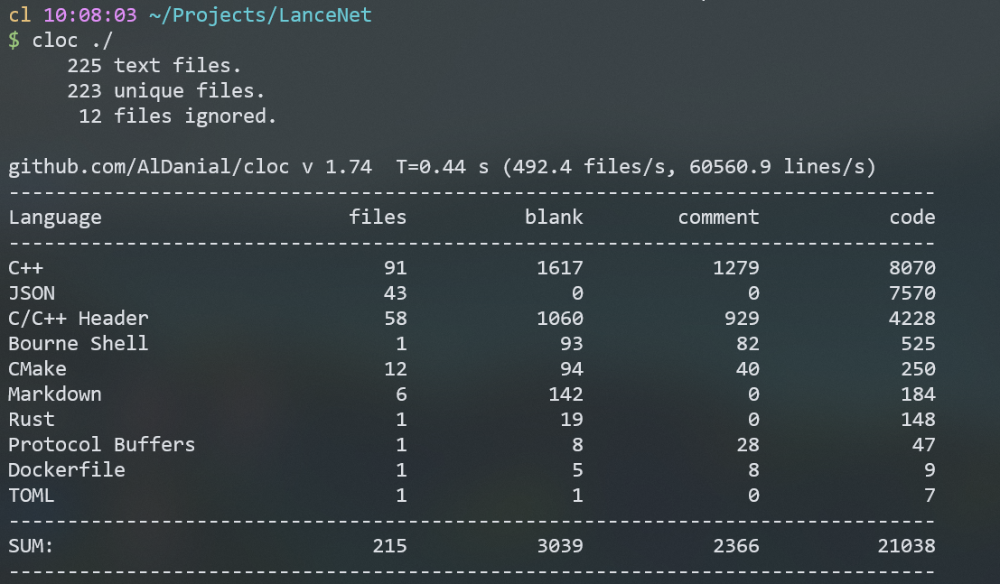

# LanceNet： 一个基于Reactor模式的高性能网络库

**代码统计**



​	本网络库旨在使用现代c++从零开始构建一个高性能的网络库，用作编程练习，将计算机网络，现代c++编程，软件工程等知识进行一次实际的项目转化，为了防止闭门造车，脱离主流的开发环境和思想，本项目的设计参考了陈硕的 《Linux多线程服务端编程》《CSAPP》《Effective Modern C++》等书籍，学习了很多实用和现代C++知识和设计思想

​	  简单来说，本项目是基于muduo重新实现的一个版本，大部分代码均进行了重写，精简或改进 （鉴于个人的水平有限，改写的过程可能会丢掉一些muduo的一些feature和少许性能）

1. **Buffer类**

   [简化] 精简了Muduo中使用readv(2)结合栈空间减少初始化buffer空间时大小的占用，**LancNet采用简化的设计**，直接使用底层vector<char\>  开辟一个小的存储空间，让底层容器自动进行内存按需增长。

   [改进] 为了有效避免一开始就给每个buffer分配大内存，而是需要的时候，向Buffer末尾添加数据，让底层容器自动管理内存增长， 同时使用**scatter input(readv(2))** 结合栈空间的方式，一次读入足够多的数据，减少系统调用

   

2. **LogStream类**: 兼顾了流式输出的优点(类型安全) 和 类似于printf方便的格式化

   [改进] 引入了了适用领域最新的**整型和浮点型数据转字符串**算法，比snprintf快数倍

   [改进 TODO] 支持类似于printf那样的格式化

3. **TimerQueue类**

   - **muduo库的方案**：为了**快速得到当前已经过时的计时器**和正确处理**同一时间多个计时器到期**的情况，muduo采用`set<pair<TimeStamp, Timer*>> ` 来管理计时器，并使用裸指针，存在泄露风险，若在原来设计上采用set<pair<TimeStamp, unique\<Timer\>>>进行改进，需要涉及C++14 [异构查找](https://www.cppstories.com/2019/05/heterogeneous-lookup-cpp14/)，同时对于set存储设计unique_ptr等只能移动的类型，C++17引入的set::[extract]([std::set::extract - cppreference.com](https://en.cppreference.com/w/cpp/container/set/extract))是唯一能将move-only object移除set的方式，这会大大引入没必要的实现复杂度。

   - **我的方案**：采用小顶堆对Timer进行管理， priority_queue存储pair类型pair<TimeStamp, vector<unique\<Timer\> > >, 简单使用TimeStamp即可查找过期的Timer，避免涉及C++14和17,

     为了正确处理移动语义，使用boost来执行成员函数绑定 boost::bind(&TimerQueue::_addTimer, this, std::move(timer)), 来得到一个std::function<void\>

     ```c++
     boost::bind(&TimerQueue::_addTimer, this, std::move(timer))
     ```

     

     

​	 说明：本项目的类名设计多数来自于muduo，一些类的接口设计也参考了muduo，但几乎所有的代码都在源代码的基础上进行了**简化和重新实现**，少许的第三方代码，例如Google 的 StringPiece等直接拷贝的源文件。


# Designs ✨

## 0. 基础库

基础库主要是对posix系列的函数进行封装，主要包括

1. 对pthread的封装
1. 对条件变量的封装
1. 对锁的封装
1. 对常见unix系统调用的封装
1. 日志库
1. 线程池
1. 高层同步设施：阻塞队列和倒计时（CountDownLatch）
1. 底层同步设施：条件变量的封装


### 0.1 多线程异步日志库

**日志格式**：[LOG_LEVEL] 20990101 12:10:01.123456 Message - Example.cpp:100

**特点：**

1. 时间戳，基于**标准库std::chrono库**，精度能达到纳秒级别

2. 更改了默认的 整数浮点数转字符串的算法

   使用 两种高性能的算法，提升了**整型和浮点型数值转字符串**的速度

   具体： snprintf 替換成領域最新的算法，速度快数倍

3. 高精度的时间间隔计算，最高精确到纳秒($1e^{-9}s$), 时间戳采用了微秒，原因是这个精度一般够用了

4. 避免使用time_t，防止在2038年发生溢出

5. 使用GCC内置的 __builtin_strrchr 在**编译期**即可获得文件名的basename

   ```c++
   #define BASENAME(FILE) (__builtin_strrchr(FILE, '/') ? __builtin_strrchr(FILE, '/') + 1 : FILE)
   ```

   

6. 支持控制台**彩色**字体输出


### 0.2 Buffer设计和使用

​	非阻塞网络编程中，如何设计并使用缓冲区？一方面希望减少系统调用次数，另一方面我们想节约内存，例如10k连接每个链接个分配一个读写缓冲区，将消耗1GB内存，但多数情况下这些缓冲区利用率是很低的。

【基本】采用readv(2)解决了这个问题：在栈上临时开辟一个空间，使用readv往buffer和这个空间填充，若数据量小，没有超过Buffer的writable字节数，直接读到Buffer中，否则读到这个临时空间，然后append到Buffer里面，避免每个连接的初始化Buffer多大造成内存浪费

【优化】进一步的，分类防止stack空间紧张，采用thread local的extrabuf进一步优化空间使用（但不能全局共享一个）


## 1. 网络库

### Feature🎈

1. 支持多线程多开EventLoop，使用Round-Robin实现了简单的**负载均衡**

2. 同时支持了**Select**、**Poll**、**Epoll**（**LT**模式）三种IO 复用方式
3. 支持应用层发送和接收**应用层缓冲区**

4. 提供了“三个半”事件的**回调接口**（详细见下文“TCP网络编程本质”），用户可用方便的注册自己的处理函数实现业务逻辑

​	 

#### TCP 网络编程本质

- 处理三个半事件

  1. 连接建立

  2. 连接断开 （主动断开close、shutdown）和 被动断开（read ()返回0）

  3. 消息到达 （文件描述符可读，涉及到如何处理分包，应用层缓冲区如何设计）

  4. 数据发送完毕（算半个事件，指的是将数据写入了TCP内核缓冲区）

     

其中有很多细节和难点需要思考：

1. 如何主动关闭连接，保证对方收到全部数据？ 特别是有应用层缓冲区的情况

2. 应用层接受缓冲区和发生缓冲区的必要性？

3. 缓冲区设置多大？ 如果每个连接分配一个读写缓冲区，但大多数时候缓冲区利用率很低，造成浪费，如何解决？

4. 接收方和发送方处理速度不一致，会不会导致数据堆积在发送方导致内存暴涨？

   

## 网络并发服务程序设计方案

1. process-per-connnection,传统的unix编程方案，使用fork，每一个连接开一个进程
2. thread-per-connection，传统的java网络编程方案，线程过多对操作系统的scheduler一个大负担。
3. Io multiplexing（select 、pool、epool） ，几乎肯定要使用 non-blocking IO，而使用非阻塞IO肯定要使用应用层buffer（难度最大）。


主要讲一下第三种，这一种本质是 （event-driven**事件驱动**）编程模型，大佬Doug Schmidt已经为我们总结好了一套范式，**Reactor**，让我们有章可循。这些通用的Reactor库包括 `libevent(c)`、`Netty(java)`、`twisted(python)`等。


**Reactor模式的主要思想**：网络编程中有很多是事务性（routine）的工作，可以提取为公用的框架或库，用户只需要填上关键的业务逻辑代码，并将回调注册到框架中，就可以实现完整的网络服务，这就是Reactor模式的主要思想。它的意义在于将消息（IO事件）分发到用户提供的处理函数，<u>并保持网络部分的通用代码不变</u>，独立于用户的业务逻辑。<u>Reactor最核心的事件分发机制，即将IO multiplex拿到的IO事件分发给各个文件描述符(fd)的事件处理函数</u>。


**本项目采用的Reactor模型**

首先看看一个普通的Reactor模型，全部的IO工作都在一个Reactor线程完成，计算任务交给thread pool，。如果计算任务彼此独立，且IO压力不大，这种方案是非常实用的，比如用来做求解数独的服务器（sudoku solver）。


本项目采用加强版，将<u>连接分散到多个Reactor线程</u>（Reactor线程也就是IO线程）：

1. 一个**主Reactor**，用于负责accept(2)链接，然后把连接挂载某个**子Reactor**中 （采用round-robin）
2. 将该连接的所有操作交给子Reactor处理，每个子Reactor将计算任务交给线程池计算，或者小规模任务直接在当前IO线程完成并直接返回结果，减少响应延迟

可见这种模型具有更强的适应性，这种结构的时序图如下：


如何选取Reactor的数量？一般来说按照**每千兆比特每秒**的吞吐量配一个event loop比较合适，并且同一个IO线程下的事件没有优先级，这是为了防止优先级反转的发生，如果你要处理心跳连接，并且认为优先级较高，那个应该用单独的IO线程管理，这样就防止了数据连接上的事件阻塞了心跳事件。


**总结**

本模型采用的编程模式为：one loop per thread + thread pool

- event loop(Reactor线程) 用作non-blocking IO和定时器
- thread pool 用来做计算，具体可以是任务队列和生产消费者队列


**服务端连接关闭**

将主动关闭连接分成两步骤来做，先关闭本地“写”端`shutdown(sock, SHUT_WR)`，防止还有数据在路上漏读，等对方关闭之后，在关本地“读”端。此过程底层通常为，服务端发完了数据，于是shutdown write，发送TCP FIN分节，对方会读到0字节，然后都放通常关闭连接，这样网络库会读到0字节，然后关闭连接（**真正调用close(fd)**)。


**为什么需要应用层缓冲区？**

用户态使用**接受缓冲区**的原因：主要原因是即便发送方一个字节一个字节的发送数据，接收端代码也能正常工作

发送方使用**发送缓冲区**的原因：防止系统的TCP换成不够导致IO线程阻塞影响性能
